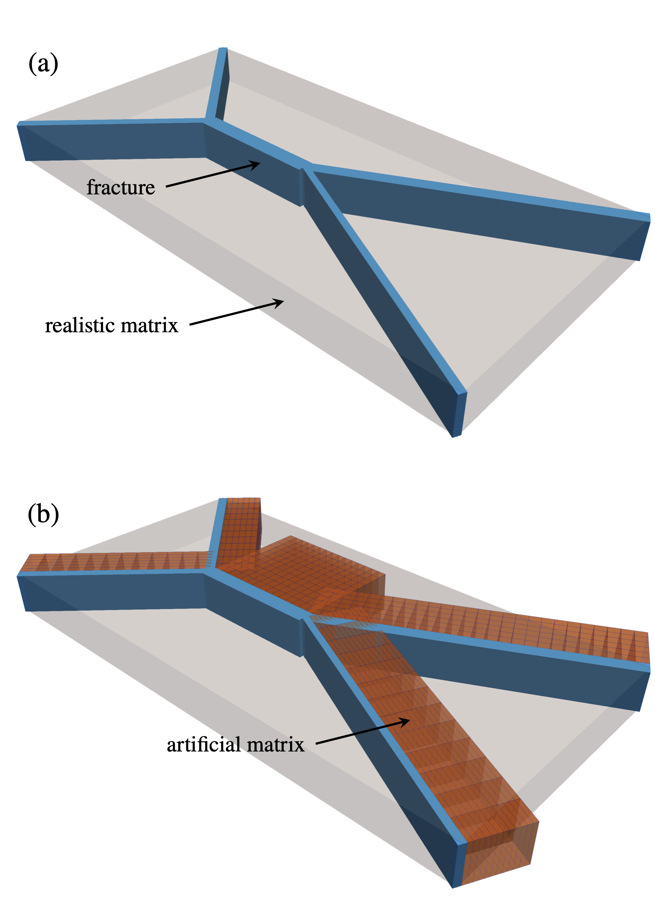
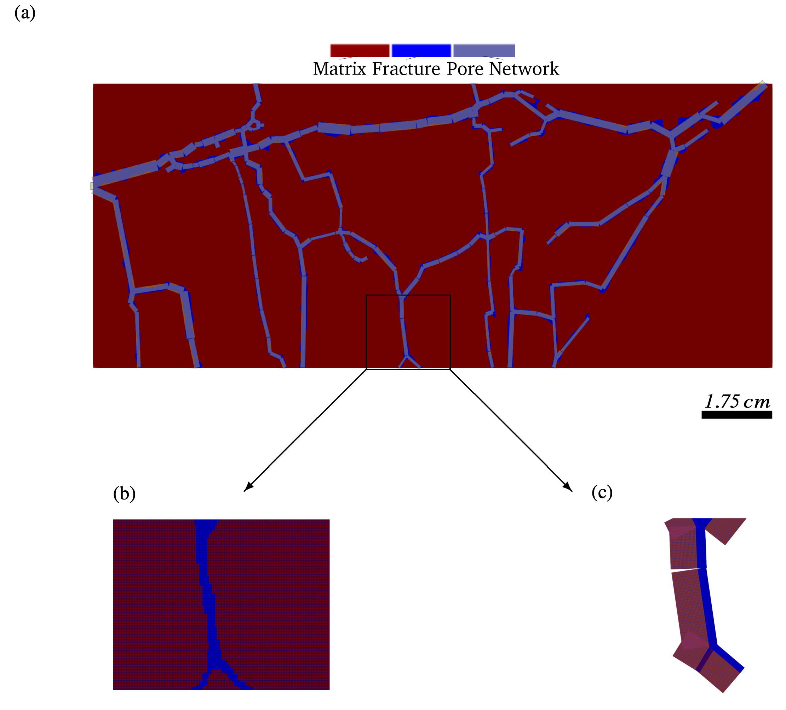
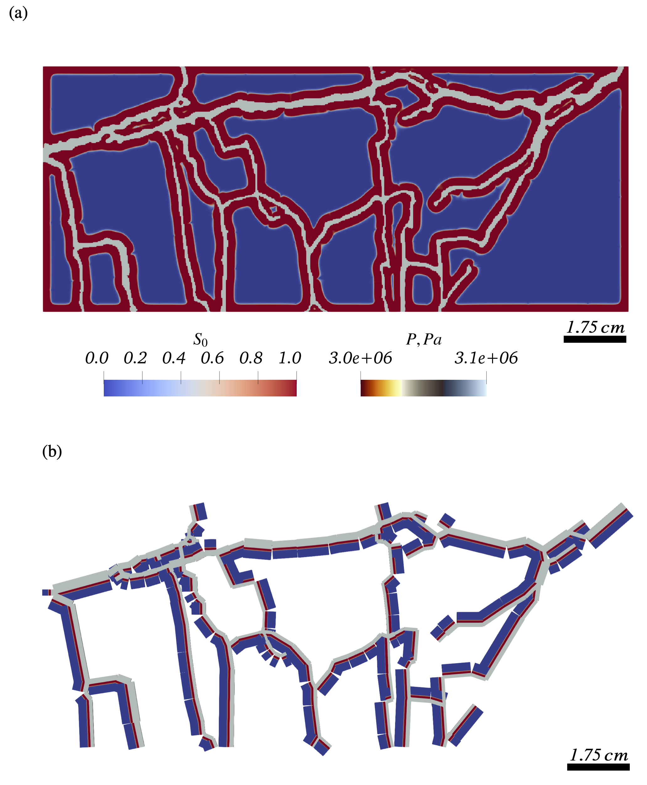
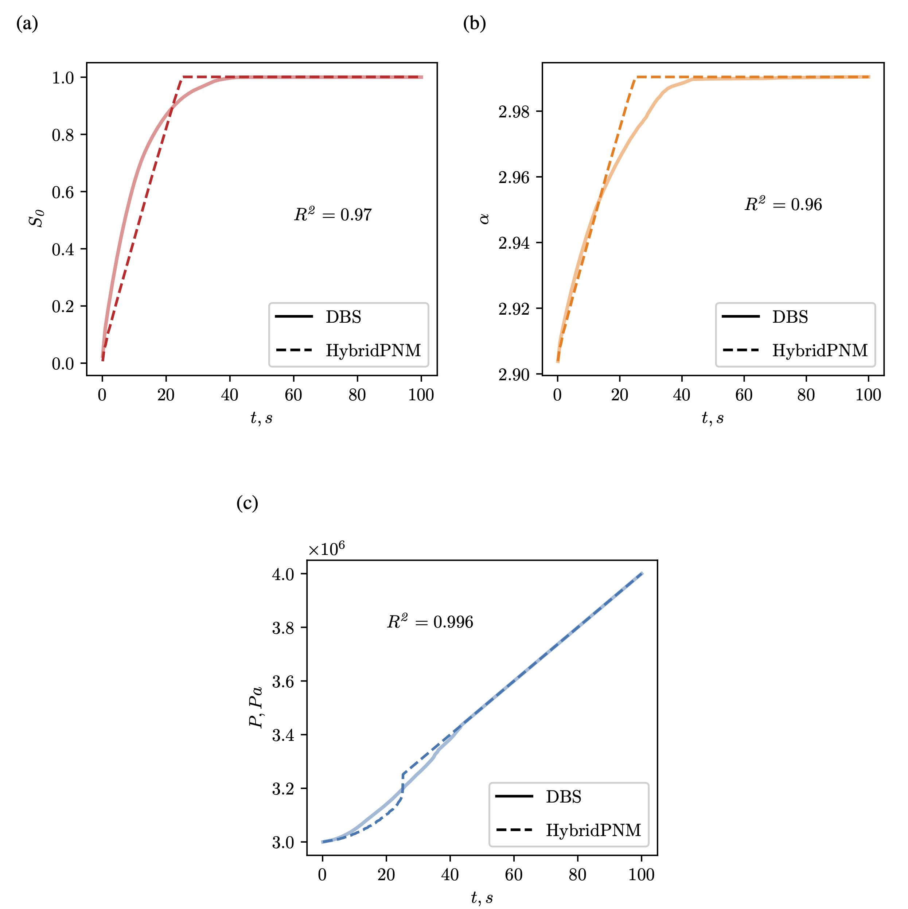

# Project Title

HybridPNM model

# Project description

HybridPNM is a software project dedicated to the developement of a novel numerical model which combines the
Hagen–Poiseuille analytical solution and the volume of fluid advection scheme for two phase fluid flow in fractures with
the continuum two-phase Darcy-based flow in the coal matrix.

The solver's engine is written using C++ OOP concepts while the python interface is provided for simplifying the process
of data manipulation.

## Motivation

The code is developed to demonstrate and validate the proposed HybridPNM method with respect to various physical
mechanisms related to fluid transport in coal seams.

## Getting Started

```
git clone https://github.com/AleksZhuravlyov/netgrid
cd netgrid && mkdir build
cmake .. && cmake --build . && cd ..
git clone https://github.com/AleksZhuravlyov/raplea
cd raplea && mkdir build
cmake .. && cmake --build . && cd ..
git clone https://github.com/AleksZhuravlyov/hybridPNM
cd hybridPNM && mkdir build
cmake .. && cmake --build . && cd ..
cd hybridPNM
doxygen
cd doc/latex && make && cd ..
cd demo
python3 demo.py
cd .. && ls cases
```

### Prerequisites

The libraries you need to install and how to install them

#### python:

```
pip3 install numpy pandas matplotlib alive-progress
```

#### macOS:

```
brew install eigen cmake vtk pybind11
```

#### Ubuntu:

```
apt-get install eigen cmake vtk pybind11

```

## Key features

The developed code has the following key features:

- Hybrid VOF-PNM model for the convective flow in open fractures;
- Two-phase Darcy-based solver for the convective flow in coal matrix;
- Coupling of VOF-PNM and Darcy models;
- Simulating multi-scale multiphase flow in the fracture/matrix system;
- Inclusion of such mechanisms as rock compressibility and sorption.

## Concept

The conceptual representation of the hybrid model is depicted in Fig. 1. In Fig. 1a, a digital image of
resolved fractures is surrounded by a non-resolved coal matrix (grey-scale zone). In Fig. 1b, the digital image is
presented for the HybridPNM concept throughout the artificially introduced matrix elements. The total volume of
such elements is equal to the matrix volume (grey-scale zone) of the digital image. The algorithm implemented in this
study implies that the volume of the matrix elements adjacent to the cleats is directly proportional to fractures’
surfaces. The HybridPNM numerical representation involves some extent of simplification by treating the artificial
matrices as non-overlapping despite, in reality, this is not always the case.



*Figure 1. Conceptual representation of (a) digital image of fractured media, (b) hybridPNM equivalent of the digital
image.*

## Validation

To validate the developed HybridPNM model, we use the previously developed Darcy-Brinkman-Stokes (DBS) solver for
benchmarking. The both solvers capture similar physical mechanisms by operating within resolved (fractures) and
unresolved (matrix) domains. In HybridPNM, the PNM-based flow in fractures is introduced into the VOF advection
scheme and explicitly coupled with the two-phase Darcy continuum model. In DBS, the Navier-Stokes equation numerically
solved within a single Darcy-Brinkman model for the flow in both open fractures and continuum matrix domain.

We use the 2D micro-CT image of coal with a developed network of connected cleats. The PN model for the HybridPNM
simulation is extracted from this image (Fig. 2a). The segmented micro-CT image and extracted PN model are then
discretised to conduct numerical simulations (Figs. 2b and 2c).



*Figure 2. Numerical mesh: (a) pore network model with underlying micro-CT image, (b) Darcy-Brinkman-Stokes
regular numerical mesh, (c) HybridPNM grid-block topology.*

The fractures are initially fully filled with water, while the matrix contains free and adsorbed and pressure across
the sample is uniform. The pressure is then gradually increased at the inlet and outlet resulting in a pressure
gradient within a matrix-fracture system. The adsorbed gas is displaced by water flowing from the fractures and
penetrating the matrix (Figs. 3a and 3b).



*Figure 3. Pressure in fractures and water saturation in coal matrix for (a) Darcy-Brinkman-Stokes and (b) HybridPNM
models.*



While the geometry of the DBS numerical mesh repeats the original segmented 2D image, the HybridPNM model operates on a
significantly simplified mesh. To compare the output of two models, we calculate average saturation, adsorbed volume
gas concentration, and average pressure inside the matrix for both solvers and compare them with respect to R-squared
values. There is an acceptable agreement within 4% between HybridPNM and reference DBS simulations for all
characteristics.

*Figure 4. Comparison between DBS and HybridPNM simulations with respect to matrix average (a) water
saturation, (b) volume gas concentration, and (c) pore pressure.*

## Publications

The publication titled 'Hybridisation of volume of fluid, pore network, and continuum Darcy models for simulating
multi-scale multi-physics flow in coal' currently being peer-reviewed. The preprint 'manuscript.pdf' is available
through this repository. 

You may want to repeat the numerical simulations presented in this manuscript. For this, the
scripts are available in the folder 'cases/'.

## Code documentation

Please use the Doxygen generator for generating documentation from annotated C++ sources. The instruction on how it can
be done is in the 'Getting Started' section.

## Authors

*[**Zakhar Lanetc**](https://github.com/lanetszb/) and [**Aleksandr Zhuravlyov**](https://github.com/AleksZhuravlyov/)

## License

This project is licensed under the MIT License wich is a permissive free software license originating at the
Massachusetts Institute of Technology (MIT) - see the [LICENSE](LICENSE) file for details

